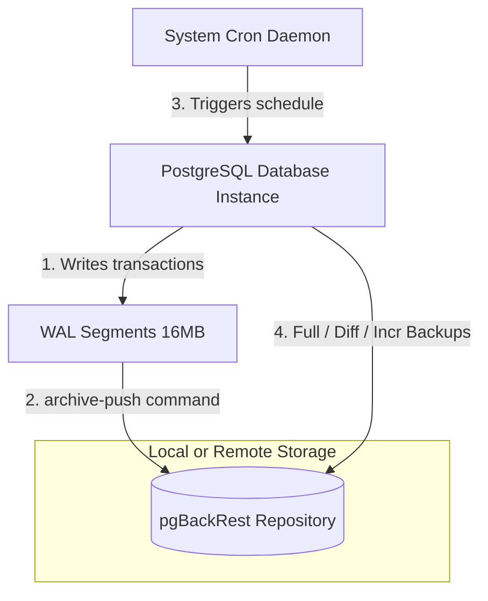
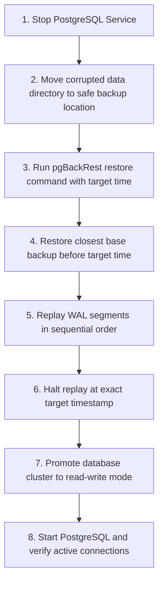

# PostgreSQL Point-in-Time Recovery (PITR) with pgBackRest

Continuous transaction archiving, scheduled backups, and automated one-command recovery for PostgreSQL 14+ clusters on Ubuntu 24.04 VM or bare-metal instances.

[](https://www.postgresql.org/)
[](https://pgbackrest.org/)
[](LICENSE)
[](https://www.shellcheck.net/)

---

## Table of Contents

1. [Key Concepts for Beginners](#key-concepts-for-beginners)
2. [Architecture Diagrams](#architecture-diagrams)
3. [Project Directory Tour](#project-directory-tour)
4. [Local Sandbox Tutorial (Step-by-Step Learning Guide)](#local-sandbox-tutorial-step-by-step-learning-guide)
5. [Daily Backup Operations Guide](#daily-backup-operations-guide)
6. [Production Deployment Walkthrough](#production-deployment-walkthrough)
7. [Troubleshooting & Operational FAQ](#troubleshooting--operational-faq)
8. [Scripting Standards & Contributing](#scripting-standards--contributing)
9. [License](#license)

---

## Key Concepts for Beginners

If you are new to database administration or backup systems, review these concepts to understand how this repository operates:

### 1. Point-in-Time Recovery (PITR)
Traditional backups only allow you to restore the database to the exact moment the backup was taken (e.g., last night at 2:00 AM). If a disaster occurs at 4:30 PM, you lose 14.5 hours of transactions.
Point-in-Time Recovery (PITR) solves this. By combining a physical base backup with a continuous stream of Write-Ahead Logs (WAL), you can reconstruct the database state at any specific second in time, like rewinding a tape.

### 2. Write-Ahead Logs (WAL)
PostgreSQL writes every database change (inserts, updates, deletes) to an internal transaction log called the Write-Ahead Log (WAL) before modifying the actual data files. This log is split into 16 MB files called WAL segments.

### 3. Continuous WAL Archiving
WAL archiving is the process of copying completed 16 MB WAL segments from the live database server to a secure, separate backup repository as soon as they fill up. Even if the primary database disk fails completely, the transaction history remains safe in the repository.

### 4. Stanza
In pgBackRest terminology, a **Stanza** is a named configuration block representing a specific PostgreSQL database cluster and its associated backup repository details. This repository uses the default stanza name `main`.

### 5. Backup Types
pgBackRest uses three backup types to optimize speed and disk storage:
* **Full Backup:** A complete copy of all database files. This forms the anchor of the restore chain.
* **Differential Backup:** A copy of only the files that have changed since the last **Full** backup. It is faster and smaller than a full backup.
* **Incremental Backup:** A copy of only the files that have changed since the last backup of **any** type (Full, Differential, or Incremental). This uses the least disk space.

---

## Architecture Diagrams

### Backup and Continuous Archiving Architecture

This diagram shows how transactions are continuously written to WAL segments, which pgBackRest immediately pushes to the backup repository while cron schedules regular full, differential, and incremental backups.



### Point-in-Time Recovery (PITR) Workflow

This diagram shows the process when the automated recovery script is executed. The database directory is cleared, the closest base backup is extracted, transaction logs are replayed up to the target timestamp, and the database is promoted.



---

## Project Directory Tour

Navigate the repository using this structural guide:

* **`.github/workflows/ci.yml`**: Automates syntax checking and ShellCheck linting on all repository bash scripts during push and pull requests.
* **`configs/pgbackrest.example.conf`**: Standalone configuration template containing optimal production parameters (asynchronous archiving, spool paths, retention sizes, and compression levels).
* **`configs/postgresql.example.conf`**: Standalone configuration parameters to enable WAL archiving within `postgresql.conf`.
* **`docker/`**: The local containerized sandbox environment.
  - `Dockerfile`: Pre-configures Ubuntu 24.04 with PostgreSQL, pgBackRest, cron, and sudo.
  - `docker-compose.yml`: Spins up the sandbox container and mounts the local `scripts/` directory.
  - `entrypoint.sh`: Automates database initialization, stanza creation, mock data loading, and baseline backup creation on container start.
* **`docs/setup-guide.md`**: Production step-by-step setup, configuration, crontab, and cron syntax guide.
* **`docs/understanding-pitr.md`**: Standard Operating Procedure (SOP) covering concepts, verification checks, and disaster scenarios.
* **`scripts/auto-recovery.sh`**: The core, automated, one-command PITR execution script.
* **`scripts/backup-now.sh`**: A helper script to run manual backups and view repository statistics.
* **`scripts/setup-pgbackrest.sh`**: An idempotent script to automate installation and verification on a clean server.

---

## Local Sandbox Tutorial (Step-by-Step Learning Guide)

This sandbox environment allows you to simulate database operations, delete data, and perform a Point-in-Time Recovery safely on your local computer.

### Step 1: Start the Sandbox

From your host terminal, navigate to the `docker` directory and run the compose command:
```bash
cd docker
docker-compose up -d --build
```
This starts a container named `pg_pitr_sandbox`. It automatically initializes the database, creates the pgBackRest configuration, starts WAL archiving, loads a sample database table, and takes a baseline full backup.

### Step 2: Access the Running Container Shell

Open a bash terminal inside the running sandbox:
```bash
docker exec -it pg_pitr_sandbox bash
```

### Step 3: Verify the Stanza and Baseline Data

Confirm that pgBackRest has successfully recorded the stanza and baseline backup:
```bash
sudo -u postgres pgbackrest info
```
Now, query the sample employee table inside the `testpitr` database:
```bash
sudo -u postgres psql -d testpitr -c "SELECT * FROM employees;"
```
Expected output:
```
 id | name  | salary |         created_at         
----+-------+--------+----------------------------
  1 | Anand |  50000 | 2026-05-20 22:15:00.123456
  2 | Riya  |  60000 | 2026-05-20 22:15:00.123456
  3 | Karan |  70000 | 2026-05-20 22:15:00.123456
```

### Step 4: Record Your Recovery Target Timestamp

Print the current system time in the correct format. This is the moment in time you will restore the database to:
```bash
date "+%Y-%m-%d %H:%M:%S"
```
*Note this timestamp (e.g., `2026-05-20 22:16:05`).*

### Step 5: Simulate a Database Disaster

Wait 5 seconds, then execute a query to delete all employee records:
```bash
sudo -u postgres psql -d testpitr -c "DELETE FROM employees;"
```
Query the database again to verify that all data is gone:
```bash
sudo -u postgres psql -d testpitr -c "SELECT * FROM employees;"
```
Expected output:
```
(0 rows)
```

### Step 6: Execute Automated Point-in-Time Recovery

Execute the recovery script, passing the target time recorded in Step 4 as the single argument:
```bash
bash /scripts/auto-recovery.sh "YOUR-TIMESTAMP-HERE"
```
During execution, the script will:
1. Stop the PostgreSQL service.
2. Back up the active database directory to `/var/lib/postgresql/14/main-old-<timestamp>`.
3. Restore the baseline physical backup using pgBackRest.
4. Instruct PostgreSQL to replay transactions and stop at the exact target second.
5. Automatically promote the database to read-write mode.
6. Verify database readiness.

### Step 7: Confirm Successful Recovery

Query the table to verify that the deleted employee rows have been restored:
```bash
sudo -u postgres psql -d testpitr -c "SELECT * FROM employees;"
```
Expected output:
```
 id | name  | salary |         created_at         
----+-------+--------+----------------------------
  1 | Anand |  50000 | 2026-05-20 22:15:00.123456
  2 | Riya  |  60000 | 2026-05-20 22:15:00.123456
  3 | Karan |  70000 | 2026-05-20 22:15:00.123456
```
You have successfully re-wound your database back in time!

---

## Daily Backup Operations Guide

Once your environment is configured, use these operations to manage backups:

### 1. Triggering Manual Backups

The script `scripts/backup-now.sh` is a CLI helper that executes backups and prints status logs. It supports three types: `full`, `diff`, and `incr`.

* **Incremental Backup (Default):**
  Only copies blocks modified since the last backup of any type.
  ```bash
  sudo ./scripts/backup-now.sh --type=incr
  ```
* **Differential Backup:**
  Only copies blocks modified since the last full backup.
  ```bash
  sudo ./scripts/backup-now.sh --type=diff
  ```
* **Full Backup:**
  Copies the entire database cluster.
  ```bash
  sudo ./scripts/backup-now.sh --type=full
  ```

### 2. Checking Repository Information

To view the history, type, sizes, and timestamps of all backups stored in your repository:
```bash
sudo -u postgres pgbackrest info
```

### 3. Running Repository Integrity Verification

Run a verification sweep to check for file corruption in the backup repository:
```bash
sudo -u postgres pgbackrest --stanza=main verify
```

---

## Production Deployment Walkthrough

To deploy this setup on an active, clean Ubuntu 24.04 server:

### Step 1: Run the Idempotent Installation Script

Copy this repository to your target server and run the automated setup script with root privileges:
```bash
sudo chmod +x scripts/*.sh
sudo ./scripts/setup-pgbackrest.sh
```
This script automates package installations, folder setup, permissions, deploys `/etc/pgbackrest.conf`, configures WAL archiving, restarts PostgreSQL, registers the stanza, and runs a validation check.

### Step 2: Configure the Backup Schedule

Configure system cron jobs for the `postgres` user. Avoid using root's crontab.
```bash
sudo -u postgres crontab -e
```
Add these lines to configure weekly full, daily differential, and hourly incremental backups:
```cron
# Full backup - weekly on Sunday at 01:00 AM
0 1 * * 0 pgbackrest --stanza=main backup --type=full

# Differential backup - daily Monday through Saturday at 02:00 AM
0 2 * * 1-6 pgbackrest --stanza=main backup --type=diff

# Incremental backup - hourly (skips hours covered by full and diff)
0 3-23 * * * pgbackrest --stanza=main backup --type=incr
0 0 * * 1-6 pgbackrest --stanza=main backup --type=incr

# Weekly repository verification - Sunday at 03:30 AM
30 3 * * 0 pgbackrest --stanza=main verify
```

### Step 3: Run the First Physical Backup

Execute a manual full backup to anchor the cron backup chain:
```bash
sudo -u postgres pgbackrest --stanza=main backup --type=full
```

---

## Troubleshooting & Operational FAQ

### Q1: The restore fails with an error: "unable to restore because path contains files"
* **Why:** As a safety mechanism, pgBackRest refuses to restore files into a non-empty data directory.
* **Resolution:** You must stop PostgreSQL and move or delete the contents of your data directory. The `auto-recovery.sh` script does this automatically. If running manually:
  ```bash
  sudo systemctl stop postgresql
  sudo mv /var/lib/postgresql/14/main /var/lib/postgresql/14/main-old
  sudo mkdir -p /var/lib/postgresql/14/main
  sudo chown postgres:postgres /var/lib/postgresql/14/main
  sudo chmod 700 /var/lib/postgresql/14/main
  ```

### Q2: After a recovery, I get errors: "cannot execute INSERT in a read-only transaction"
* **Why:** By default, PostgreSQL remains in a read-only standby/recovery state after completing a restore.
* **Resolution:** Ensure you pass `--target-action=promote` to your restore command (which is default in `auto-recovery.sh`). If the database is already running and read-only, promote it manually:
  ```bash
  sudo -u postgres psql -c "SELECT pg_promote();"
  ```

### Q3: How do I monitor repository storage growth?
* **Resolution:** Run a disk usage check on your repository path:
  ```bash
  df -h /var/lib/pgbackrest
  ```
  If repository usage exceeds 80%, consider lowering the full backup retention counts in `/etc/pgbackrest.conf` (e.g., set `repo1-retention-full=4`) or adding disk space.

---

## License

This project is licensed under the MIT License - see the [LICENSE](LICENSE) file for details.
